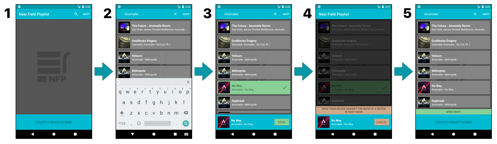
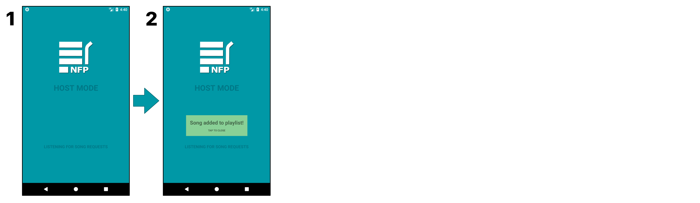

# Near Field Playlist

An Android app for building Spotify playlists in a social setting using Near Field Communication (NFC).

**Watch a demonstration video below!**

## Requirements

* Near Field Playlist requires two devices with NFC radios, at least one Spotify account, and Android version 5.0 or later. Upon starting the application, you will be prompted with a browser to sign into Spotify. After signing in, the application will enter “Guest Mode”. To switch to “Host mode”, you press the “HOST” button at the menu bar.

## Guest Mode

* Guest mode allows you to search for Spotify songs. Press the search icon in the menu bar to enter your search query. It only allows you to search for song names.
* Select a song that you want to send to a host by clicking it on the list view.
   * You may change your selected song by clicking on a different one
* Press the send button to make the phone try to send the song information through NFC
   * You may cancel the attempt to send the song by pressing Cancel
* Tap this phone against the back of another phone in Host Mode.
   * Android Beam will start, press anywhere on the screen on the screen
* Guest mode will then be freed up and will allow you to search for a new song

## Host Mode

* Entering host mode will get or create a playlist on your Spotify account called “NFP Playlist”.
   * If anything goes wrong, a Toast will notify you.
* In Host Mode, the application is constantly waiting for an NFC connection from another phone in Guest Mode.
* After connecting with another device in Guest Mode, this device will add the received song to the playlist.
   * A toast will notify you if the song was successfully added or if there was an error
* Device will continue listening for new NFC connections

## Known Bugs
* There may be an issue with signing into Spotify if the native Spotify app is also installed on your device. If you encounter this error, uninstall the native Spotify app and try again, or use another device that does not have Spotify installed.
* Sometimes the browser will hang when trying to sign into Spotify, if this happens, kill the application and open it again. It should sign in properly this time.

## Notes
* If you would like to manage or play the songs in the playlist, you must be playing the song on a new device.
* If you want to sign out of your Spotify account, or switch Spotify accounts, open up the default web browser that your phone uses and go to spotify.com and log out.
